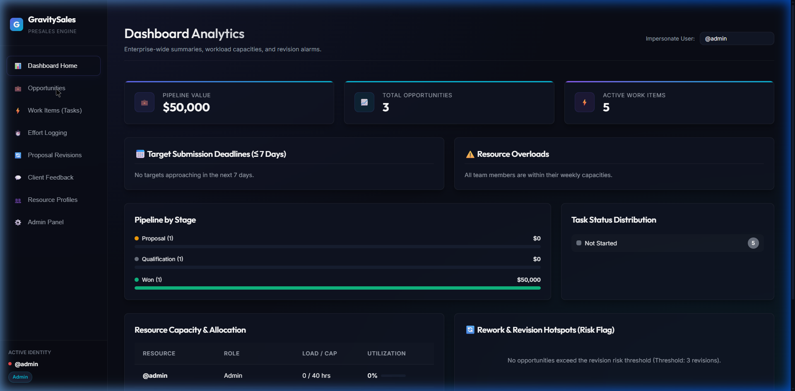
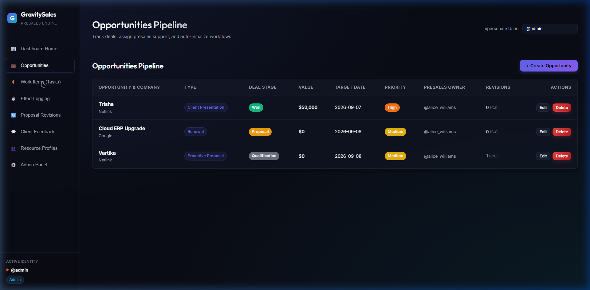
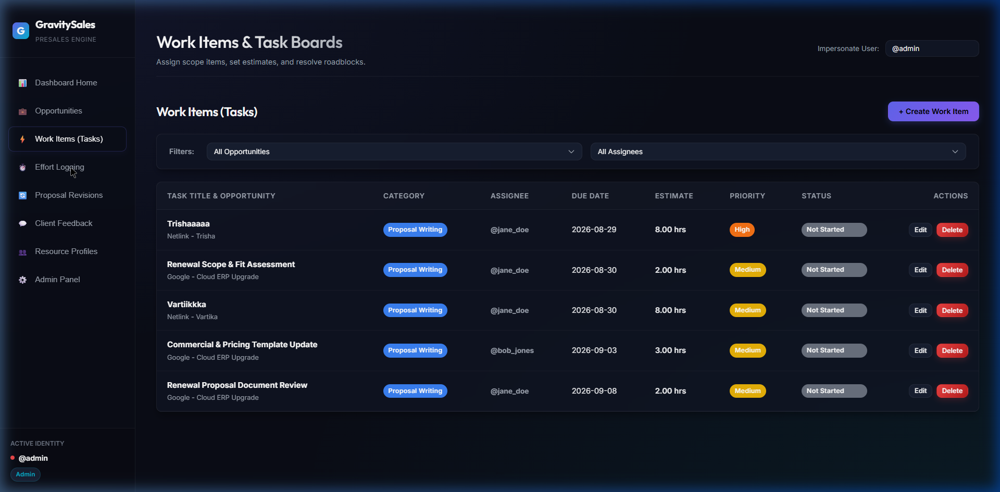
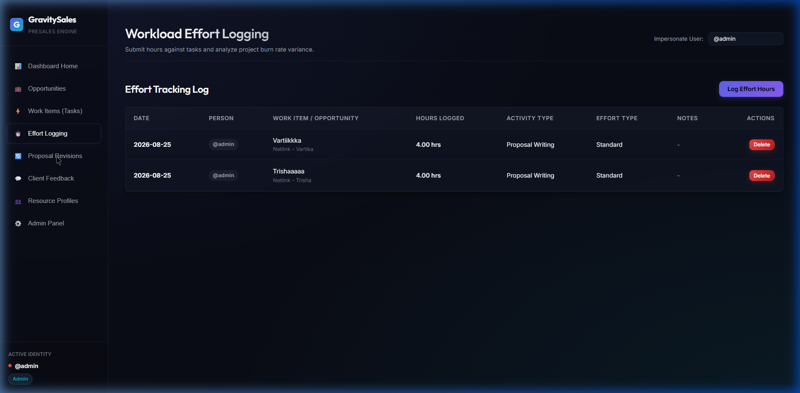
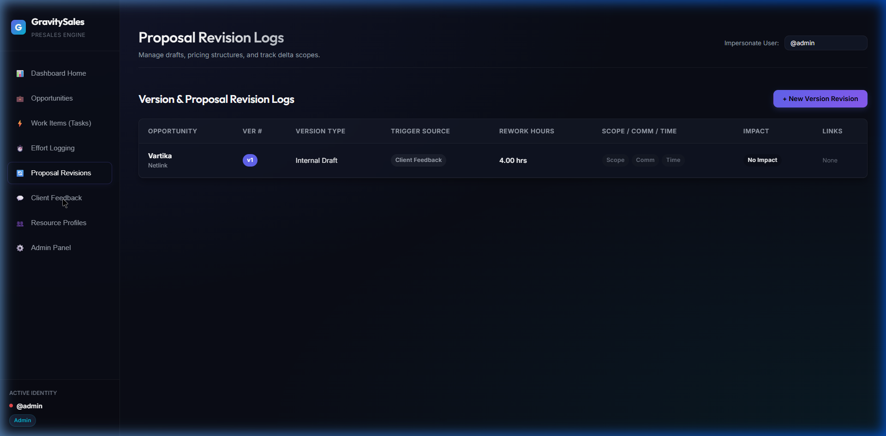
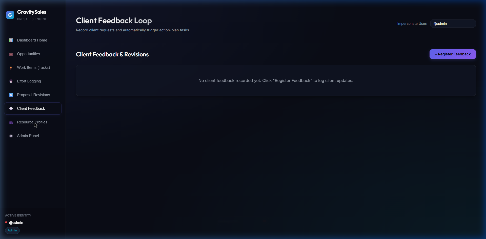
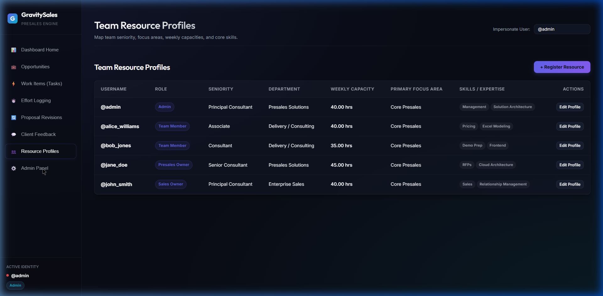

# GravitySales Presales Engine — Complete Technical & UI/UX Documentation

Welcome to the official developer and design documentation for **GravitySales Presales Engine**, an enterprise solution built for managing presales pipelines, tracking proposal revisions, logging team effort, managing workload capacities, and capturing client feedback loops.

---

## 🛠️ 1. Technology Stack

| Layer | Technology / Tool | Description |
| :--- | :--- | :--- |
| **Framework** | **Next.js 14.2** (App Router) | Server and client component rendering, dynamic API routing, and file-based page routing. |
| **Frontend Core** | **React 18** | Functional UI components, custom hooks, and state management using React Context API. |
| **Styling & Tokens** | **Vanilla CSS3** (`src/app/globals.css`) | Dual-theme Design System featuring "The Ledger" (Warm Minimal) and "Obsidian Dark" with CSS Variables (`:root`). |
| **Typography** | **Google Fonts** (`Outfit` & `Inter`) | `Outfit` for bold headers and metric titles; `Inter` for clean body copy and data tables. |
| **Database & Pooling** | **PostgreSQL** & **Supabase** | `pg` connection pool with auto-SSL support for Supabase database host & `@supabase/supabase-js` client. |
| **State Management** | **React Context** (`AppContext.js`) | Global state for impersonated users, role permissions, dynamic dropdown options, and resource profiles. |

---

## 🎨 2. UI/UX Design System & Theme Architecture ("The Ledger")

The application features **"The Ledger" (Warm Minimal)** design system, prioritizing accessibility, professional readability, and dynamic theme switching.

```
+-----------------------------------------------------------------------------+
|                      THE LEDGER (WARM MINIMAL) TOKENS                       |
+-----------------------------------------------------------------------------+
| Background Primary  : #F7F4EE (Warm Linen Paper)                            |
| Background Secondary: #EFEAE0 (Paper Band / Section Fill)                   |
| Paper Panel          : #FFFFFF (White Ledger Page)                          |
| Border Subtle        : #E5E0D8 (1px Hairline Border)                        |
+-----------------------------------------------------------------------------+
| Text Primary        : #1C1810 (Warm Ink — not pure black/gray)              |
| Text Secondary      : #6B6357 (Muted warm slate)                            |
+-----------------------------------------------------------------------------+
| Primary Accent      : #6366f1 (Indigo — MUST match Obsidian dark theme)     |
| Secondary Accent    : #06b6d4 (Cyan — MUST match Obsidian dark theme)       |
| Purple Accent       : #8b5cf6 (used sparingly, same as dark theme)          |
+-----------------------------------------------------------------------------+
|                    12% TINT BADGES — TEXT USES DEEPENED HUE                 |
| Status Success : text #047857 on rgba(16, 185, 129, 0.12)                   |
| Status Warning : text #B45309 on rgba(245, 158, 11, 0.14)                   |
| Status Danger  : text #B91C1C on rgba(239, 68, 68, 0.12)                    |
| Status Info    : text #1D4ED8 on rgba(59, 130, 246, 0.12)                   |
+-----------------------------------------------------------------------------+
```

### Mandatory Design System Rules
1. **Accent colors are shared across both themes, always.** Indigo `#6366f1`, Cyan `#06b6d4`, and Purple `#8b5cf6` are the only accents in the entire product, in both themes.
2. **Never use full-saturation status hex as text on its own tint.** Full-saturation hex text on tint background fails WCAG contrast. Always use deepened text hexes (`#047857`, `#B45309`, `#B91C1C`, `#1D4ED8`).
3. **Background Primary is `#F7F4EE`.**
4. **Text colors are warm-toned.** `#1C1810` (Warm Ink) and `#6B6357` (Muted Warm Slate).

---

## 📱 3. Live Application Pages & Feature Modules

Below are the complete feature descriptions for every page in the application:

### 3.1. Dashboard Analytics Home (`DashboardTab.js`)

The **Dashboard** provides executive-level visibility into deal value, workload allocations, target submission alarms, and rework risk hotspots.

- **Pipeline Value Metric Card**: Displays total aggregated deal value across all active opportunities.
- **Total Opportunities & Active Work Items**: Real-time counter of active pipeline deals and pending work tasks.
- **Deadlines Alert Panel**: Highlights deals with target submission dates within <= 7 days.
- **Resource Overload Monitor**: Real-time capacity warnings when team utilization exceeds 100%.
- **Rework & Revision Hotspots**: Identifies high-risk opportunities exceeding warning revision thresholds.



---

### 3.2. Opportunities Pipeline (`OpportunitiesTab.js`)

The **Opportunities** view manages incoming sales leads, presales assignments, deal values, and win probabilities.

- **Pipeline Data Table**: Displays company names, opportunity types, deal stages, contract values, target dates, priorities, assigned presales owners, and revision counters.
- **Action Triggers**: Inline Edit and Delete buttons for managing pipeline deals.
- **Opportunity Creation Modal**: Paper-panel modal form to add deal details, contract tenure, complexity, and special instructions.
- **Auto-Task Initialization**: Automatically populates default work tasks based on the selected opportunity type (e.g., RFP Response vs. Proactive Proposal).



---

### 3.3. Work Items & Task Boards (`WorkItemsTab.js`)

The **Work Items** tab functions as the tactical task management hub for solution architects and consultants.

- **Filters & Search**: Filter tasks by **All Opportunities** or **All Assignees**.
- **Task Data Grid**: Displays task titles, linked opportunity, work categories, assigned owner, due dates, estimated hours, priorities, and status badges.
- **12% Tint Status Badges**: Visual status indicators (`Not Started`, `In Progress`, `Review`, `Blocked`, `Completed`).
- **Roadblock Flagging**: Assign tasks to "Blocked" status with required blocker notes for team escalation.



---

### 3.4. Workload Effort Logging (`EffortLogsTab.js`)

Enables team members to log actual hours spent against specific work items.

- **Effort Log Submission**: Form to record daily hours worked, activity types (Scoping, Architecture, Pricing, Review), and progress notes.
- **Timesheet Summary Table**: Tracks total logged hours per person, date, activity type, and related task.
- **Burn Rate Variance**: Calculates variance between estimated vs. actual logged hours per task.



---

### 3.5. Proposal Revision Logs (`VersionsTab.js`)

Tracks proposal iterations and scope creep across complex client negotiations.

- **Revision Counter**: Automatically increments version numbers per opportunity.
- **Delta Scope Checkers**: Flag whether a revision modified Commercial Pricing, Technical Scope, or Delivery Timelines.
- **Rework Impact Calculator**: Log rework hours and record deadline impact levels (Minor Delay, Critical Block).



---

### 3.6. Client Feedback Loop (`FeedbackTab.js`)

Captures feedback from client decision-makers and technical review panels.

- **Feedback Logging**: Record feedback severity (Low, Medium, High, Critical) and trigger sources.
- **Automated Task Creation**: Option to automatically convert actionable feedback into a new Work Item task.



---

### 3.7. Team Resource Profiles (`ResourceProfilesTab.js`)

Manages presales team members, roles, weekly capacities, and core skill sets.

- **Member Profile Cards**: View weekly capacity hours, seniority level, department, and standard focus areas.
- **Skill Mapping**: Search and filter resources by technical skills (e.g., Cloud Architecture, RFPs, Demo Prep).


---

### 3.8. Configuration Console / Admin Panel (`AdminTab.js`)

The administrative central console for managing dynamic system picklists and automation rules.

- **Dynamic Picklist Manager**: Modify options across 19 categories (Opportunity Types, Deal Stages, Work Categories, Deliverable Types, etc.) with custom color swatches and sort order.
- **Task Template Manager**: Scaffold default scoping tasks for deliverable types.
- **Automation Thresholds**: Configure capacity overload warnings, effort variance alert limits, and revision risk thresholds.



---

## 👩‍💻 4. Important Guidelines for UI/UX Developers

### 4.1. Layout Hierarchy & Structural Layout
- **Sidebar Navigation**: Fixed left column width `260px` (`.sidebar`) rendered with paper panel styling.
- **Main Container**: Offset by `margin-left: 260px` with `padding: 2.5rem`.
- **Header Bar**: Displays current tab title, subtitle description, user impersonation control, and theme switcher toggle.

### 4.2. Restore the Signature "Fold" Interaction

Cards in the bright theme feature a folded-corner detail with a top accent line that draws in on hover:

```css
/* Ledger Card Base */
.paper-panel {
  background: var(--paper-panel);
  border: 1px solid var(--border-subtle);
  border-radius: var(--radius-md);
  box-shadow: var(--shadow-sm);
  color: var(--text-primary);
  position: relative;
  overflow: hidden;
}

/* Folded corner */
.paper-panel::after {
  content: '';
  position: absolute;
  top: 0; right: 0;
  width: 22px; height: 22px;
  background: linear-gradient(135deg, transparent 50%, var(--bg-secondary) 50%);
  transition: width 180ms ease, height 180ms ease;
}

/* Top accent rule — draws in on hover, not a static border */
.paper-panel::before {
  content: '';
  position: absolute;
  top: 0; left: 0; height: 2px;
  width: 0%;
  background: linear-gradient(90deg, var(--accent-primary), var(--accent-secondary));
  transition: width 220ms ease;
}

.paper-panel-hover:hover {
  transform: translateY(-2px);
  box-shadow: var(--shadow-md);
}
.paper-panel-hover:hover::after { width: 30px; height: 30px; }
.paper-panel-hover:hover::before { width: 100%; }
```

### 4.3. Status Badges & Tint Formula
```css
.badge-success { background: var(--color-success-bg); color: var(--color-success-text); }
.badge-warning { background: var(--color-warning-bg); color: var(--color-warning-text); }
.badge-danger  { background: var(--color-danger-bg);  color: var(--color-danger-text);  }
.badge-info    { background: var(--color-info-bg);    color: var(--color-info-text);    }
.badge-neutral { background: var(--bg-secondary);     color: var(--text-secondary);     }
```

### 4.4. Professional Button System (Both Themes)

Buttons across the app adhere to a strict visual hierarchy, 3 size levels, and complete interactive states.

#### Hierarchy
1. **Primary** — One per view/section max. The single main action (e.g., "Create Opportunity," "Save Changes").
2. **Secondary** — Supporting actions next to a primary (e.g., "Cancel," "Modify").
3. **Ghost/Text** — Low-emphasis actions, inline table actions, tertiary links.
4. **Danger** — Destructive actions only ("Delete," "Remove Member").

#### Sizing
- `sm` (32px height, padding `0 12px`): Tables and inline actions.
- `md` (40px height, padding `0 16px`): Default form buttons.
- `lg` (48px height, padding `0 20px`): Modal primary CTAs.

#### Interactive States Implemented
- **Rest**: Base button style.
- **Hover**: Subtle lift / brighten.
- **Active/press**: `transform: scale(0.98)`, tactile feedback.
- **Focus-visible**: 2px accent outline ring with 2px offset for keyboard accessibility (`outline: 2px solid var(--accent-primary); outline-offset: 2px;`).
- **Disabled**: `opacity: 0.45; cursor: not-allowed; pointer-events: none;`.

#### CSS Implementation — Ledger (Bright Theme)
```css
.btn {
  height: 40px;
  padding: 0 16px;
  border-radius: var(--radius-sm);
  font-family: 'Outfit', sans-serif;
  font-weight: 600;
  font-size: 0.9rem;
  display: inline-flex;
  align-items: center;
  gap: 8px;
  border: none;
  cursor: pointer;
  transition: transform 120ms ease, box-shadow 120ms ease, background 120ms ease;
}

.btn-primary {
  background: var(--accent-primary);
  color: #FFFFFF;
  box-shadow: 0 1px 2px rgba(28,24,16,0.08);
}
.btn-primary:hover {
  background: #4F52E0; /* accent-primary, ~8% darker */
  box-shadow: 0 6px 16px rgba(99,102,241,0.24);
  transform: translateY(-1px);
}
.btn-primary:active { transform: scale(0.98); box-shadow: 0 1px 2px rgba(28,24,16,0.08); }

.btn-secondary {
  background: var(--paper-panel);
  color: var(--text-primary);
  border: 1px solid var(--border-subtle);
}
.btn-secondary:hover {
  border-color: var(--accent-primary);
  color: var(--accent-primary);
}

.btn-ghost {
  background: transparent;
  color: var(--text-secondary);
  padding: 0 8px;
}
.btn-ghost:hover { color: var(--text-primary); background: var(--bg-secondary); }

.btn-danger {
  background: transparent;
  color: #B91C1C;
  border: 1px solid rgba(239,68,68,0.3);
}
.btn-danger:hover { background: rgba(239,68,68,0.08); }

.btn:disabled { opacity: 0.45; cursor: not-allowed; pointer-events: none; }
.btn:focus-visible { outline: 2px solid var(--accent-primary); outline-offset: 2px; }
```

#### CSS Implementation — Obsidian (Dark Theme)
```css
[data-theme="dark"] .btn-primary {
  background: linear-gradient(90deg, var(--accent-primary), var(--accent-secondary));
  color: #FFFFFF;
  box-shadow: 0 2px 8px rgba(99,102,241,0.25);
}
[data-theme="dark"] .btn-primary:hover {
  box-shadow: 0 4px 20px rgba(99,102,241,0.4);
  transform: translateY(-1px);
}
[data-theme="dark"] .btn-primary:active { transform: scale(0.98); }

[data-theme="dark"] .btn-secondary {
  background: var(--glass-bg);
  color: var(--text-primary);
  border: 1px solid var(--glass-border);
  backdrop-filter: blur(12px);
}
[data-theme="dark"] .btn-secondary:hover { border-color: rgba(99,102,241,0.4); }

[data-theme="dark"] .btn-ghost {
  background: transparent;
  color: var(--text-secondary);
}
[data-theme="dark"] .btn-ghost:hover { color: var(--text-primary); background: rgba(255,255,255,0.04); }

[data-theme="dark"] .btn-danger {
  background: transparent;
  color: #F87171;
  border: 1px solid rgba(239,68,68,0.35);
}
[data-theme="dark"] .btn-danger:hover { background: rgba(239,68,68,0.12); }
```

---

## 9. Recent System Workflows & Configuration Updates

### A. Task Templates Work Category Configuration
- **Database Schema**: Added `work_category_id` (foreign key to `dropdown_options`) on the `task_templates` table.
- **Admin Configuration Console**:
  - The Task Template creation and edit modal includes a **Work Category** dropdown picklist options (*Proposal Writing*, *Product demo*, *technical scoping*, *Pricing*, *Documentation*).
  - The Auto-initialized Scope Tasks table displays a dedicated **Work Category** column for each task template.
  - When new opportunities auto-scaffold tasks based on deliverable types, each generated task inherits its template's assigned work category.

### B. Effort Tracking Log Multi-Filtering
- **Top Filter Bar**: Added an interactive Filter Bar to the Effort Tracking Log view containing:
  - **Filter by Opportunity**: Scopes logs to specific active opportunities.
  - **Filter by Deliverable Type**: Scopes logs to deliverable classifications (*RFP*, *Proposal*, etc.).
  - **Filter by Logging Person**: Scopes logs to individual team members (`@admin`, `@jane_doe`, `@bob_jones`, `@alice_williams`, `@john_smith`).
- **Form Opportunity Selector**: The *Log Effort Workload* modal features an Opportunity selector at the top that dynamically scopes the available Work Item Tasks dropdown.

### C. Work Items Table Refinement & Global App-Themed Dialog System
- **Work Items Table**: Removed the Status column from the main Work Items (Tasks) grid table for cleaner details display.
- **Global App-Themed Dialogs**: Replaced all native browser popups (`alert`, `confirm`, `prompt`) with unified, application-themed Toast notifications, confirmation modals, alert dialogs, and link insertion prompts styled under "The Ledger" design system.


